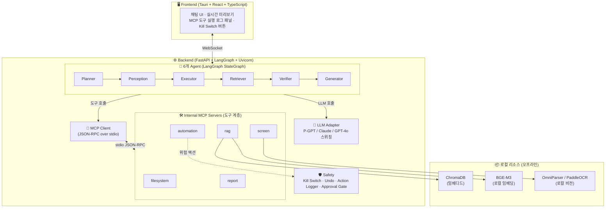

# 🤖 P-Agent (POSCO FUTURE M GUI-based AI Agent)

> 자연어 명령만으로 PC GUI를 조작하여 웹/사내 자료를 검색·검증하고,
> 정부 부처 대응 보고서(Word/PPT)를 자동 생성하는 **포터블 데스크톱 앱**

P-Agent는 사내 폐쇄망 환경에서 동작하도록 설계된 GUI 기반 AI Agent입니다.
LLM은 사내 **P-GPT** API를 기본으로 사용하며, 개발 단계에서는 Claude/GPT로 자유롭게
전환할 수 있습니다. 모든 도구(파일 조작, 화면 인식, PC 자동화, RAG, 보고서 생성)는
**자체 MCP 서버**로 구현되어 확장성·보안·테스트 용이성을 확보했습니다.

---

## 🏗 아키텍처



---

## 🧩 핵심 설계 원칙

### 1. 포터블(Portable) 우선
- **절대경로 금지** — 모든 경로는 `Path(__file__).parent` 기준 상대경로
- Python `.venv`, Node `node_modules`, 캐시/로그/출력물 모두 **프로젝트 폴더 내부**(`./data/`, `./logs/`, `./output/`)
- 시스템 환경변수 의존 금지 — 모든 설정은 `.env`에서 로드
- USB로 폴더째 이동해도 그대로 동작

### 2. LLM Adapter (Provider 스위칭)
`.env`의 `LLM_PROVIDER` 값에 따라 자동 전환됩니다.

| 값 | 용도 | 비고 |
|---|---|---|
| `anthropic` | 개발용 | Claude API |
| `openai` | 개발용 | GPT-4o 등 |
| `pgpt` | **배포용** | 사내 P-GPT (OpenAI 호환 형식 가정) |

### 3. 자체 MCP 서버 (도구 프로토콜 표준화)
Agent는 **직접 함수를 호출하지 않고** 반드시 MCP 클라이언트를 통해 도구를 호출합니다.
- **확장성**: 새 도구 추가 시 MCP 서버만 추가하면 됨
- **보안**: 도구 실행 권한을 MCP 서버 레벨에서 제어
- **테스트**: 도구를 독립 프로세스로 단독 테스트 가능
- **P-GPT 호환**: 향후 P-GPT가 MCP를 지원하면 즉시 연동

자세한 내용은 [`MCP_GUIDE_KR.md`](./MCP_GUIDE_KR.md) 참고.

### 4. 안전장치 (Safety)
- **Human-in-the-loop**: 위험 액션은 사용자 승인(Approval Gate) 후 실행
- **Kill Switch(ESC)**: 어떤 상황에서도 전역 단축키로 즉시 중단
- **Undo**: 액션 스택 기반 되돌리기
- **Action Logger**: 모든 액션을 `./logs/actions.jsonl`에 기록

---

## 📁 폴더 구조

```
P-Agent/
├── README.md                  ← (이 문서)
├── SETUP_GUIDE_KR.md          ← 비개발자용 설치 가이드
├── MCP_GUIDE_KR.md            ← MCP 구조 설명 / 새 도구 추가법
├── .env.example
├── .gitignore
├── run_backend.bat / run_frontend.bat / run_all.bat / first_time_setup.bat
│
├── backend/
│   ├── pyproject.toml
│   └── app/
│       ├── main.py            ← FastAPI + WebSocket 엔트리
│       ├── agents/            ← Planner/Perception/Executor/Retriever/Verifier/Generator + graph
│       ├── mcp_servers/       ← ★ 자체 MCP 서버 (filesystem/screen/automation/rag/report)
│       ├── mcp_client/        ← ★ MCP 클라이언트 + LangGraph tool 자동 등록
│       ├── llm/               ← LLM Adapter (pgpt/anthropic/openai + factory)
│       ├── rag/               ← ChromaDB 벡터 스토어
│       ├── safety/            ← kill_switch/undo/action_logger/approval_gate
│       ├── security/          ← 개인정보 마스킹
│       ├── scenarios/         ← 소듐이온배터리 정책동향 시나리오
│       └── config/            ← settings.py + whitelist.json
│
├── frontend/                  ← Tauri + React + shadcn/ui
├── models/                    ← bge-m3 / omniparser (로컬 모델)
├── data/  logs/  output/      ← 런타임 산출물 (git 미추적)
```

---

## 🚀 빠른 시작

### 최초 1회 (회사 PC)
```
first_time_setup.bat  더블클릭
```
uv 설치 → `.venv` 생성 → 의존성 설치 → 모델 다운로드 → `.env` 생성까지 자동.

### 실행
```
run_all.bat  더블클릭
```
`.env`/`.venv` 확인 → MCP 서버 헬스체크 → 백엔드 + 프론트엔드 동시 실행.

> 상세 절차는 [`SETUP_GUIDE_KR.md`](./SETUP_GUIDE_KR.md) 참고.

---

## 🛠 기술 스택

| 영역 | 스택 |
|:---:|:---|
| LLM | P-GPT / Claude / GPT-4o (Adapter로 스위칭) |
| **도구 프로토콜** | **MCP (JSON-RPC over stdio) — 자체 서버 구현** |
| Vision/OCR | OmniParser, PaddleOCR (로컬 모델) |
| RAG | ChromaDB + BGE-M3 (로컬) |
| PC 자동화 | PyAutoGUI, Playwright, pywinauto |
| Frontend | Tauri + React + TypeScript + shadcn/ui |
| Backend | FastAPI + LangGraph + Uvicorn |
| 문서 생성 | python-docx, python-pptx |
| 패키지 관리 | uv (Python) / pnpm (Node) |

---

## ⚠️ 디스클레이머
- 본 앱은 사내 업무 보조 목적이며, 생성된 보고서의 최종 검토 책임은 사용자에게 있습니다.
- PC 자동화 기능은 화이트리스트/승인 게이트/Kill Switch로 통제됩니다.
