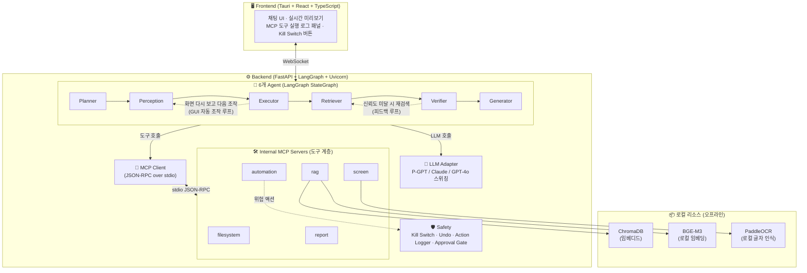

# 🤖 PFM-Agent (POSCO FUTURE M GUI-based AI Agent)

> 자연어 명령만으로 PC GUI를 조작하여 웹/사내 자료를 검색·검증하고,
> 정부 부처 대응 보고서(Word/PPT)를 자동 생성하는 **포터블 데스크톱 앱**

PFM-Agent는 사내 폐쇄망 환경에서 동작하도록 설계된 GUI 기반 AI Agent입니다.
LLM은 사내 **P-GPT** API를 기본으로 사용하며, 개발 단계에서는 Claude/GPT로 자유롭게
전환할 수 있습니다. 모든 도구(파일 조작, 화면 인식, PC 자동화, RAG, 보고서 생성)는
**자체 MCP 서버**로 구현되어 확장성·보안·테스트 용이성을 확보했습니다.

---

## 🏗 아키텍처



---

## 🧩 핵심 설계 원칙

### 1. 포터블(Portable) 우선
- **절대경로 금지** — 모든 경로는 `Path(__file__).parent` 기준 상대경로
- Python `.venv`, Node `node_modules`, 캐시/로그/출력물 모두 **프로젝트 폴더 내부**(`./data/`, `./logs/`, `./output/`)
- 시스템 환경변수 의존 금지 — 모든 설정은 `.env`에서 로드
- USB로 폴더째 이동해도 그대로 동작

### 2. LLM Adapter (Provider 스위칭)
`.env`의 `LLM_PROVIDER` 값에 따라 자동 전환됩니다.

| 값 | 용도 | 비고 |
|---|---|---|
| `anthropic` | 개발용 | Claude API |
| `openai` | 개발용 | GPT-4o 등 |
| `pgpt` | **배포용** | 사내 P-GPT (OpenAI 호환 형식 가정) |

### 3. 자체 MCP 서버 (도구 프로토콜 표준화)
Agent는 **직접 함수를 호출하지 않고** 반드시 MCP 클라이언트를 통해 도구를 호출합니다.
- **확장성**: 새 도구 추가 시 MCP 서버만 추가하면 됨
- **보안**: 도구 실행 권한을 MCP 서버 레벨에서 제어
- **테스트**: 도구를 독립 프로세스로 단독 테스트 가능
- **P-GPT 호환**: 향후 P-GPT가 MCP를 지원하면 즉시 연동

자세한 내용은 [`MCP_GUIDE_KR.md`](./MCP_GUIDE_KR.md) 참고.

### 4. GUI 자동 조작 루프 (핵심 기능)

**자연어로 지시하면 앱이 스스로 화면을 보고 PC 를 조작한다.** 미리 만든 대본을
밀어붙이지 않고, 사람이 PC 를 쓰는 방식과 같은 순서를 반복한다.

```
        ┌─────────────────────────────────────────┐
        ▼                                         │
  화면 인식 ──▶ 판단(LLM) ──▶ 조작 1회 ──▶ 결과 관찰 ┘
 list_ui_elements   다음 한 걸음    automation.*    (다시 화면 인식)
                         │
                         └──▶ done / give_up ──▶ 종료
```

한 걸음마다 화면을 **다시** 읽으므로 화면이 예상과 달라도 판단을 바꿀 수 있다.
LLM 은 매번 **조작 하나만** JSON 으로 답한다.

```json
{"action": "click", "target": "검색", "reason": "검색을 시작하려면 눌러야 함"}
{"action": "type",  "text": "소듐이온배터리", "reason": "검색어 입력"}
{"action": "done",  "reason": "결과 목록이 표시됨"}
```

판단 로직은 [`gui_loop.py`](./backend/app/agents/gui_loop.py), 실행은
[`executor.py`](./backend/app/agents/executor.py) 에 있다.

**🔴 폭주 방지 (4중 안전장치)**

| # | 안전장치 | 구현 |
|:-:|---|---|
| 1 | 조작 수 상한 | `GUI_MAX_STEPS`(기본 15, 하드 상한 50)를 넘으면 중단 |
| 2 | 제자리 감지 | 같은 조작이 3번 반복되면 중단 (`is_stuck`) |
| 3 | 승인 게이트 | 모든 조작은 사용자 승인 후 실행 (레지스트리가 강제) |
| 4 | Kill Switch | 매 조작 전 ESC 확인 (`ensure_alive`) |

추가로 **화면 요소 목록에 없는 대상은 클릭하지 않는다**(`validate_decision`).
LLM 이 엉뚱한 좌표를 찍어 잘못된 곳을 누르는 것을 코드로 막는다.
화면 인식이 실패하면 **조작을 아예 시도하지 않는다.**

**폐쇄망 대비:** LLM 을 쓸 수 없으면 Planner 의 계획 문장을 키워드로 해석해
순서대로 실행하는 방식으로 자동 전환된다. 적응력은 없지만 멈추지는 않는다.
`GUI_LOOP_ENABLED=false` 로 자동 조작을 완전히 끌 수도 있다.

### 5. 피드백 루프 (오케스트레이션)

Agent 파이프라인은 **한 방향으로만 흐르지 않는다.** Verifier 가 근거의 신뢰도를
기준치 미만으로 판단하면 Generator 로 가지 않고 **Retriever 로 되돌아가**
다른 검색어로 자료를 다시 모은다.

```
Retriever ──▶ Verifier ──(신뢰도 ≥ 기준)──▶ Generator
    ▲             │
    └─────────────┘  신뢰도 < 기준 → 대체 검색어로 재검색 (근거는 누적)
```

- 대체 검색어는 LLM 이 제안하고, **LLM 이 죽으면 규칙 기반**(조사 제거 + 범위 확대)으로 만든다 → 폐쇄망에서도 동작
- 재검색은 **누적**이다. 이전 회차에서 찾은 근거를 버리지 않는다.
- `.env` 로 조절: `AGENT_MAX_ITERATIONS`(기본 2 = 최대 1회 재검색), `AGENT_CONFIDENCE_THRESHOLD`(기본 50)
- `AGENT_MAX_ITERATIONS=1` 로 두면 루프가 비활성화되어 기존 단방향 동작이 된다.

**무한 루프 방지 (3중 + 그래프 상한)**

| # | 안전장치 | 구현 |
|:-:|---|---|
| 1 | 회차 상한 | `should_retry()` — `iteration >= max_iterations` 면 중단 (하드 상한 5) |
| 2 | 검색어 중복 금지 | `select_new_queries()` — 이미 시도한 검색어는 제외 |
| 3 | 새 검색어 없으면 재검색 안 함 | 같은 조건 반복은 결과가 같으므로 진행 |
| + | 그래프 상한 | Retriever 진입 시 `retry_reason` 초기화 + `recursion_limit` 회차 비례 계산 |

> 재검색해도 신뢰도가 낮으면 보고서를 **만들되** "사람이 반드시 검토하라"는
> 경고를 남긴다. 근거가 부족하다는 이유로 결과를 내놓지 않는 일은 없다.

### 6. 성능 / 자원 관리

측정 도구를 함께 넣어 두었다. 회사 PC 에서 직접 확인할 수 있다.

```bash
cd backend
uv run python ../scripts/benchmark.py     # LLM 없이 동작 (폐쇄망 OK)
```

적용된 최적화와 실측값(컨테이너 기준, 서버 5개 / 도구 15개):

| 항목 | 개선 전 | 개선 후 | 효과 |
|---|---:|---:|---|
| MCP 서버 기동 | 2.583s | **0.735s** | 순차 → **동시 기동** (3.5배) |
| MCP 서버 종료 | 0.572s | **0.189s** | 순차 → **동시 종료** (3.0배) |
| 그래프 준비(실행당) | 7.8ms | **0.3µs** | 실행마다 재컴파일 → **캐시 재사용** |
| 전체 테스트 시간 | 207s | **64s** | 위 개선의 누적 효과 (3.2배) |

메모리는 **상한을 두어** 앱을 켜 둔 채 요청을 계속 넣어도 늘어나지 않는다.

| 대상 | 상한 | 넘으면 |
|---|---|---|
| 실행 1건당 이벤트 | 2,000건 | 오래된 이벤트부터 버림 |
| 이벤트 보관 실행 수 | 50건 | 가장 오래된 실행 기록 버림 |
| 실행 기록(RunManager) | 50건 | **끝난** 실행부터 버림 (진행 중인 실행은 보존) |

### 7. 실제 화면 환경에서 확인된 결함 (수정 완료)

개발 컨테이너에 **가상 디스플레이(Xvfb)를 띄워 실제로 화면을 캡처하며** 검증한
결과, 코드만 읽어서는 드러나지 않는 결함 4건을 찾아 고쳤다.
모두 **회사 PC 에서 실제로 기능이 죽는** 문제였다.

| # | 증상 | 원인 | 수정 |
|:-:|---|---|---|
| 1 | 부모 프로세스는 캡처되는데 **screen 서버만 실패** | MCP SDK 가 환경변수를 좁은 허용 목록으로 걸러 `DISPLAY` 를 제거 | `GUI_ENV_VARS` 를 명시적으로 서버에 전달 (`client.py`) |
| 2 | OCR 실행 순간 **MCP 연결 자체가 끊김** (`Failed to parse JSONRPC message`) | PaddleOCR 이 진행 상황을 **stdout(=JSON-RPC 통신선)** 에 출력 | 도구 실행 구간에 `protect_stdout()` 보호막 (`base_server.py`) |
| 3 | 폐쇄망에서 **OCR 이 영구히 동작 불가** | 모델이 홈 폴더(`~/.paddleocr`)에 저장 → USB 로 안 따라옴. `PADDLE_OCR_BASE_DIR` 는 **존재하지 않는 환경변수**였음 | det/rec/cls 경로를 **프로젝트 내부**로 명시 (`ocr_model_dirs()`) |
| 4 | 리눅스에서 조작 시도 시 **서버 프로세스가 종료** | PyAutoGUI 가 tkinter 없으면 `ImportError` 가 아니라 `sys.exit()` → `except Exception` 으로 못 잡음 | `BaseException` 까지 붙잡아 한글 안내로 변환 |

추가로 **성능 결함 1건**: OCR 엔진을 호출마다 새로 생성(모델 재적재, 수 초)하던
것을 캐시하도록 고쳤다. 또 `vision` 확장에 `paddlepaddle` 이 빠져 있어
`uv sync --extra vision` 이 **설치는 성공하고 실행만 실패**하던 문제도 수정했다.

회사 PC 에서 화면 관련 기능을 한 번에 점검하려면:

```bash
cd backend
uv run python ../scripts/verify_display.py               # 읽기 전용 점검
uv run python ../scripts/verify_display.py --allow-input # 마우스 실제 이동까지 확인
```

### 8. 안전장치 (Safety)
- **Human-in-the-loop**: 위험 액션은 사용자 승인(Approval Gate) 후 실행
- **Kill Switch(ESC)**: 어떤 상황에서도 전역 단축키로 즉시 중단
- **Undo**: 액션 스택 기반 되돌리기
- **Action Logger**: 모든 액션을 `./logs/actions.jsonl`에 기록

---

## 📁 폴더 구조

```
PFM-Agent/
├── README.md                  ← (이 문서)
├── SETUP_GUIDE_KR.md          ← 비개발자용 설치 가이드
├── MCP_GUIDE_KR.md            ← MCP 구조 설명 / 새 도구 추가법
├── .env.example
├── .gitignore
├── run_backend.bat / run_frontend.bat / run_all.bat / first_time_setup.bat
│
├── backend/
│   ├── pyproject.toml
│   └── app/
│       ├── main.py            ← FastAPI + WebSocket 엔트리
│       ├── agents/            ← Planner/Perception/Executor/Retriever/Verifier/Generator
│       │                        + graph(StateGraph)
│       │                        + gui_loop(GUI 조작 판단) + feedback(재검색 판단)
│       ├── mcp_servers/       ← ★ 자체 MCP 서버 (filesystem/screen/automation/rag/report)
│       ├── mcp_client/        ← ★ MCP 클라이언트 + LangGraph tool 자동 등록
│       ├── llm/               ← LLM Adapter (pgpt/anthropic/openai + factory)
│       ├── rag/               ← ChromaDB 벡터 스토어
│       ├── safety/            ← kill_switch/undo/action_logger/approval_gate
│       ├── security/          ← 개인정보 마스킹
│       ├── scenarios/         ← 소듐이온배터리 정책동향 시나리오
│       └── config/            ← settings.py + whitelist.json
│
├── frontend/                  ← Tauri + React + shadcn/ui
├── models/                    ← bge-m3 / ocr (로컬 모델, 프로젝트 내부)
├── data/  logs/  output/      ← 런타임 산출물 (git 미추적)
```

---

## ✅ 구현 현황

| STEP | 내용 | 상태 |
|---|---|:---:|
| 1 | 프로젝트 세팅 + 문서화 | ✅ |
| 2 | LLM Adapter (P-GPT / Claude / GPT) | ✅ |
| 3 | 자체 MCP 서버 인프라 (5개 서버 / 15개 도구) | ✅ |
| 4 | Backend + LangGraph 6개 Agent | ✅ |
| 5 | 안전장치 (Kill Switch / 승인 / Undo / 기록) | ✅ |
| 6 | Perception & Executor (화면 인식 / PC 조작) | ✅ |
| 7 | Retriever & Verifier (RAG / 마스킹 / 화이트리스트) | ✅ |
| 8 | Report Generator (Word / PPT) | ✅ |
| 9 | Frontend (Tauri + React) | ✅ |
| 10 | USB 배포 스크립트 + 모델 다운로드 | ✅ |
| 11 | 최종 검증 체크리스트 (14항목) | ✅ |
| 12 | 피드백 루프 (Verifier → Retriever 재검색) | ✅ |
| 13 | **GUI 자동 조작 루프** (화면 인식 → 판단 → 조작 반복) | ✅ |
| 14 | 실제 화면(가상 디스플레이) 검증 + 결함 4건 수정 | ✅ |

검증 명령:
```bash
cd backend
uv run python -m pytest tests -q             # 단위/통합 테스트 (325개)
uv run python -m pytest tests/test_feedback_loop.py -q  # 피드백 루프 / 무한 루프 방지
uv run python -m pytest tests/test_performance.py -q    # 성능·메모리 상한
uv run python ../scripts/final_check.py      # 최종 체크리스트 14항목
uv run python ../scripts/benchmark.py        # 성능 측정 (LLM 불필요)
uv run python ../scripts/verify_display.py   # 실제 화면 기능 검증 (회사 PC 에서)
uv run python -m app.mcp_client --healthcheck   # 도구 서버 상태
```

> ⚠️ **`uv run pytest` 가 아니라 `uv run python -m pytest` 를 쓴다.**
> `.venv` 안의 실행 파일(`pytest.exe`, `uvicorn.exe` 등)에는 **만들어질 때의
> 절대경로가 새겨져** 있어서, 폴더를 옮기거나 이름을 바꾸면 동작하지 않는다.
> (`uv sync` 로도 복구되지 않는다) 인터프리터 자체는 영향을 받지 않으므로
> **`python -m` 형태로만 실행**하면 폴더를 옮겨도 그대로 동작한다.
> 실행용 `.bat` 파일도 모두 이 방식으로 되어 있다.

---

## 🚀 빠른 시작

### 최초 1회 (회사 PC)
```
first_time_setup.bat  더블클릭
```
uv 설치 → `.venv` 생성 → 의존성 설치 → 모델 다운로드 → `.env` 생성까지 자동.

### 실행
```
run_all.bat  더블클릭
```
`.env`/`.venv` 확인 → MCP 서버 헬스체크 → 백엔드 + 프론트엔드 동시 실행.

> 상세 절차는 [`SETUP_GUIDE_KR.md`](./SETUP_GUIDE_KR.md) 참고.

---

## 🛠 기술 스택

| 영역 | 스택 |
|:---:|:---|
| LLM | P-GPT / Claude / GPT-4o (Adapter로 스위칭) |
| **도구 프로토콜** | **MCP (JSON-RPC over stdio) — 자체 서버 구현** |
| Vision/OCR | PaddleOCR (로컬 모델, 프로젝트 내부 저장) |
| RAG | ChromaDB + BGE-M3 (로컬) |
| PC 자동화 | PyAutoGUI, Playwright, pywinauto |
| Frontend | Tauri + React + TypeScript + shadcn/ui |
| Backend | FastAPI + LangGraph + Uvicorn |
| 문서 생성 | python-docx, python-pptx |
| 패키지 관리 | uv (Python) / pnpm (Node) |

---

## ⚠️ 알아두어야 할 제약

**환경에 따라 동작하지 않는 기능이 있습니다.** 앱은 이런 경우 멈추지 않고
한글로 사유를 안내한 뒤 나머지 기능으로 계속 동작합니다.

| 기능 | 필요 조건 | 없을 때 동작 |
|---|---|---|
| 화면 캡처 / PC 조작 | 실제 화면(디스플레이) | 사유 안내 후 조작 없이 진행 |
| 글자 인식(OCR) | `uv sync --extra vision` + 모델 | 화면 인식 기능만 비활성 |
| 의미 기반 문서 검색 | `./models/bge-m3` | **키워드 검색으로 자동 전환** |
| ESC 전역 단축키 | Windows(권장) | 화면의 정지 버튼으로 대체 |
| 웹 검색 | 인터넷 + 화이트리스트 | 사내 RAG 만으로 동작 |
| 재검색 검색어 제안 | LLM(P-GPT) 응답 | **규칙 기반 검색어로 자동 전환** |

## ⚠️ 디스클레이머
- 본 앱은 사내 업무 보조 목적이며, 생성된 보고서의 **최종 검토 책임은 사용자**에게 있습니다.
- 개인정보 마스킹은 정규식 기반으로 100% 탐지를 보장하지 않습니다. 반드시 사람이 확인하세요.
- PC 자동화 기능은 화이트리스트 / 승인 게이트 / Kill Switch 로 통제됩니다.
